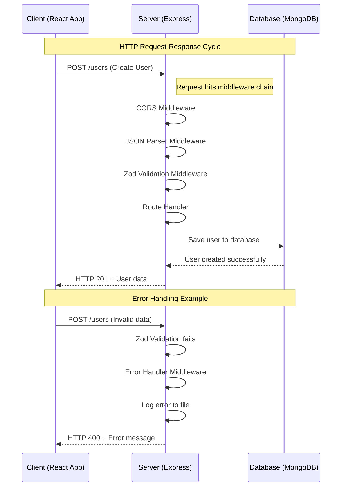
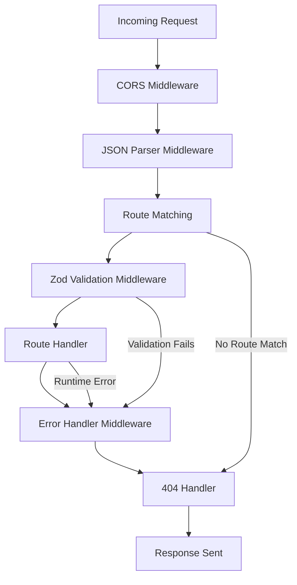
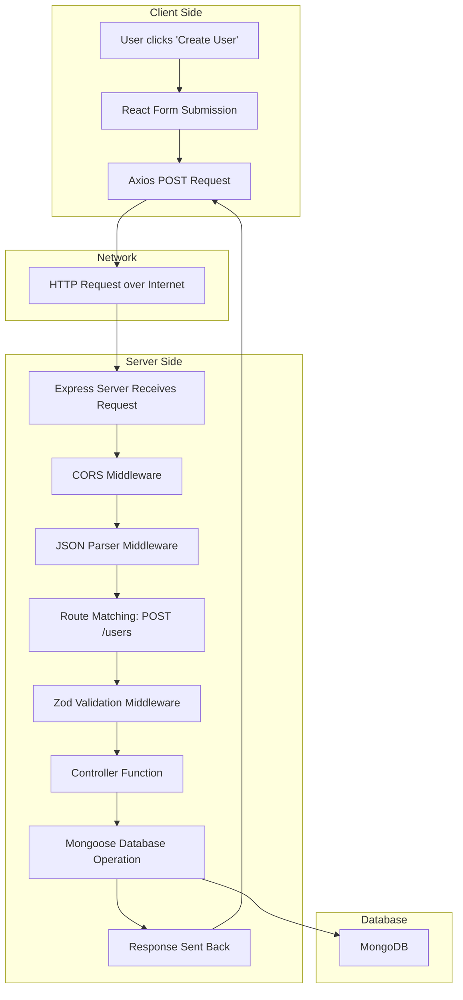

# Real Estate Project - Educational Full-Stack Application

This project is designed for **educational purposes** to demonstrate modern full-stack web development concepts, with a special focus on understanding the **HTTP request-response cycle** and **middleware patterns** in Node.js/Express.js applications.

## 🎯 Learning Objectives

By working with this project, students will understand:

- **HTTP Request-Response Cycle**: How web communication works between client and server
- **Middleware Architecture**: How to process requests in a pipeline pattern
- **RESTful API Design**: Building scalable and maintainable web APIs
- **Data Validation**: Using Zod for runtime type checking and validation
- **Error Handling**: Centralized error management and logging
- **Full-Stack Integration**: Connecting React frontend with Express backend
- **Database Operations**: CRUD operations with MongoDB and Mongoose

## 📋 Project Overview

This is a **Real Estate Management System** that includes:

### Backend Features

- User management (CRUD operations)
- Property listings management
- Input validation with Zod schemas
- Centralized error handling with logging
- RESTful API endpoints
- MongoDB integration with Mongoose

### Frontend Features

- React with TypeScript and Vite
- Tailwind CSS with DaisyUI components
- React Router for navigation
- Axios for API communication
- Responsive design

## 🌐 Understanding the HTTP Request-Response Cycle

### What is HTTP?

HTTP (HyperText Transfer Protocol) is the foundation of data communication on the web. It's a request-response protocol where:

1. **Client** (browser/frontend app) sends a **request** to a server
2. **Server** processes the request and sends back a **response**
3. **Client** receives and handles the response

### HTTP Methods Used in This Project

| Method   | Purpose              | Example Endpoint                  |
| -------- | -------------------- | --------------------------------- |
| `GET`    | Retrieve data        | `GET /users` - Get all users      |
| `POST`   | Create new data      | `POST /users` - Create a user     |
| `PUT`    | Update existing data | `PUT /users/:id` - Update user    |
| `DELETE` | Remove data          | `DELETE /users/:id` - Delete user |



## 🔧 Middleware Architecture

Middleware functions are the **heart** of Express.js applications. They execute in sequence during the request-response cycle and can:

- Execute code
- Modify request/response objects
- End the request-response cycle
- Call the next middleware function

### Middleware Chain in This Project



### 1. Global Middleware (Applied to all routes)

```typescript
// In app.ts
app.use(cors()); // Enable cross-origin requests
app.use(express.json()); // Parse JSON request bodies
```

### 2. Route-Specific Middleware

```typescript
// In UsersRoutes.ts
userRouter.route('/').post(zodValidate(userInputSchema), createUser); // Validation before handler
```

### 3. Error Handling Middleware

```typescript
// In errorHandler.ts - Always has 4 parameters
const errorHandler: ErrorRequestHandler = async (err, req, res, next) => {
  // Log error to file with timestamp
  // Send appropriate HTTP status code
  // Return error message to client
};
```

## 🗂️ Project Structure

```
the_real_estate_project/
├── 📁 client/                    # React Frontend
│   ├── src/
│   │   ├── components/           # Reusable UI components
│   │   ├── pages/               # Route components
│   │   └── main.tsx             # Application entry point
│   └── package.json
│
├── 📁 server/                    # Express Backend
│   ├── src/
│   │   ├── controllers/         # Request handlers
│   │   ├── middlewares/         # Custom middleware functions
│   │   ├── models/              # Database schemas (Mongoose)
│   │   ├── routes/              # API route definitions
│   │   ├── schemas/             # Zod validation schemas
│   │   └── app.ts               # Server entry point
│   ├── log/                     # Error logs directory
│   └── package.json
│
└── README.md                     # This file
```

## 🛠️ Key Technologies

### Backend Stack

- **Node.js**: JavaScript runtime for server-side development
- **Express.js**: Web framework for building APIs
- **TypeScript**: Type-safe JavaScript for better development experience
- **MongoDB**: NoSQL database for data storage
- **Mongoose**: Object modeling library for MongoDB
- **Zod**: Schema validation library for runtime type checking
- **CORS**: Cross-Origin Resource Sharing middleware

### Frontend Stack

- **React**: UI library for building user interfaces
- **TypeScript**: Type-safe development
- **Vite**: Fast build tool and development server
- **Tailwind CSS**: Utility-first CSS framework
- **DaisyUI**: Component library for Tailwind CSS
- **React Router**: Client-side routing
- **Axios**: HTTP client for API calls

## 🚀 Getting Started

### Prerequisites

- Node.js (v18 or higher)
- MongoDB (local installation or MongoDB Atlas)
- Git

### 1. Clone the Repository

```bash
git clone <repository-url>
cd the_real_estate_project
```

### 2. Server Setup

```bash
cd server
npm install
```

Create environment files:

```bash
# .env.development.local
PORT=3000
MONGO_URI=mongodb://localhost:27017/real_estate_db
```

Start the server:

```bash
npm run dev
```

### 3. Client Setup

```bash
cd ../client
npm install
npm run dev
```

### 4. Test the Application

- Backend: http://localhost:3000
- Frontend: http://localhost:5173

## 📚 API Endpoints

### Users API

| Method | Endpoint     | Description     | Body Example                                    |
| ------ | ------------ | --------------- | ----------------------------------------------- |
| GET    | `/users`     | Get all users   | -                                               |
| GET    | `/users/:id` | Get user by ID  | -                                               |
| POST   | `/users`     | Create new user | `{"name": "John", "email": "john@example.com"}` |
| PUT    | `/users/:id` | Update user     | `{"name": "Jane", "email": "jane@example.com"}` |
| DELETE | `/users/:id` | Delete user     | -                                               |

### Listings API

| Method | Endpoint        | Description        | Body Example                                  |
| ------ | --------------- | ------------------ | --------------------------------------------- |
| GET    | `/listings`     | Get all listings   | -                                             |
| GET    | `/listings/:id` | Get listing by ID  | -                                             |
| POST   | `/listings`     | Create new listing | `{"title": "House", "price": 500000}`         |
| PUT    | `/listings/:id` | Update listing     | `{"title": "Updated House", "price": 550000}` |
| DELETE | `/listings/:id` | Delete listing     | -                                             |

## 🔄 Request Flow Example

Let's trace a complete request through the system:



## 📝 Learning Exercises

### Exercise 1: Understanding Middleware Order

Try moving the `errorHandler` middleware before the routes in `app.ts`. What happens and why?

### Exercise 2: Custom Middleware

Create a logging middleware that logs every request method and URL to the console.

### Exercise 3: Validation Testing

Send invalid data to the API endpoints and observe how Zod validation works.

### Exercise 4: Error Simulation

Use the `/test-error` endpoint to see how error handling and logging works.

## 🔍 Debugging Tips

1. **Check the logs**: Error logs are stored in the `server/log/` directory
2. **Use the test endpoint**: Visit `/test-error` to see error handling in action
3. **Monitor the console**: Both client and server log important information
4. **Use browser developer tools**: Check the Network tab for HTTP requests/responses

## 📖 Additional Resources

- [Express.js Middleware Guide](https://expressjs.com/en/guide/using-middleware.html)
- [HTTP Status Codes](https://developer.mozilla.org/en-US/docs/Web/HTTP/Status)
- [Zod Documentation](https://zod.dev/)
- [MongoDB CRUD Operations](https://docs.mongodb.com/manual/crud/)

---
