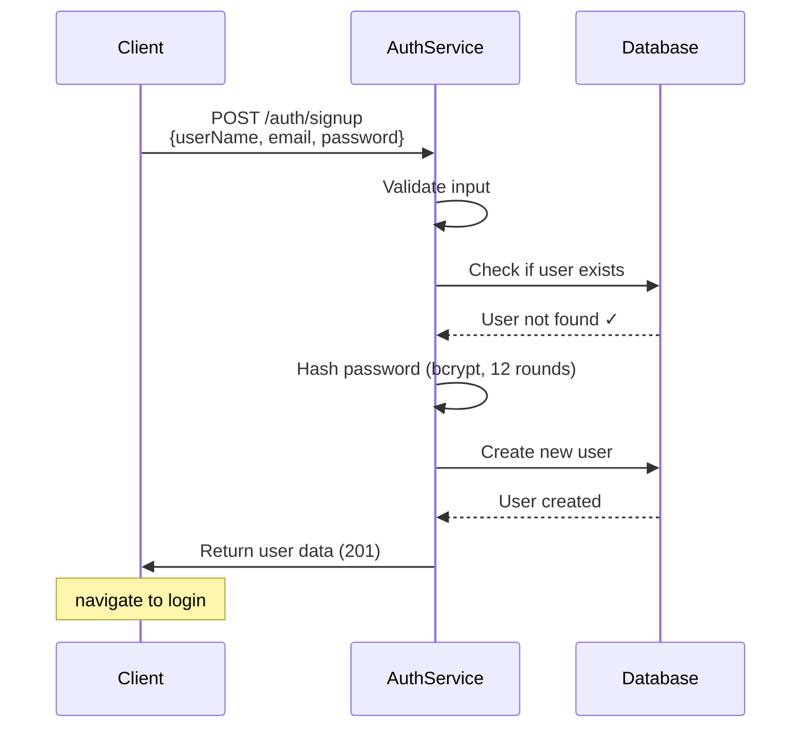
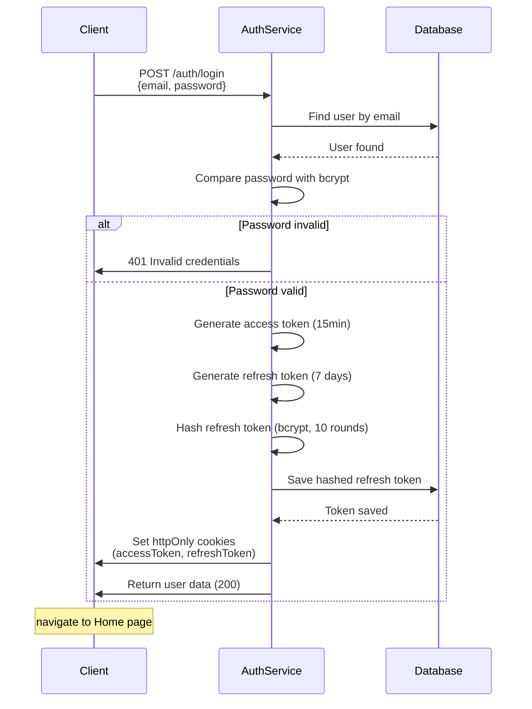
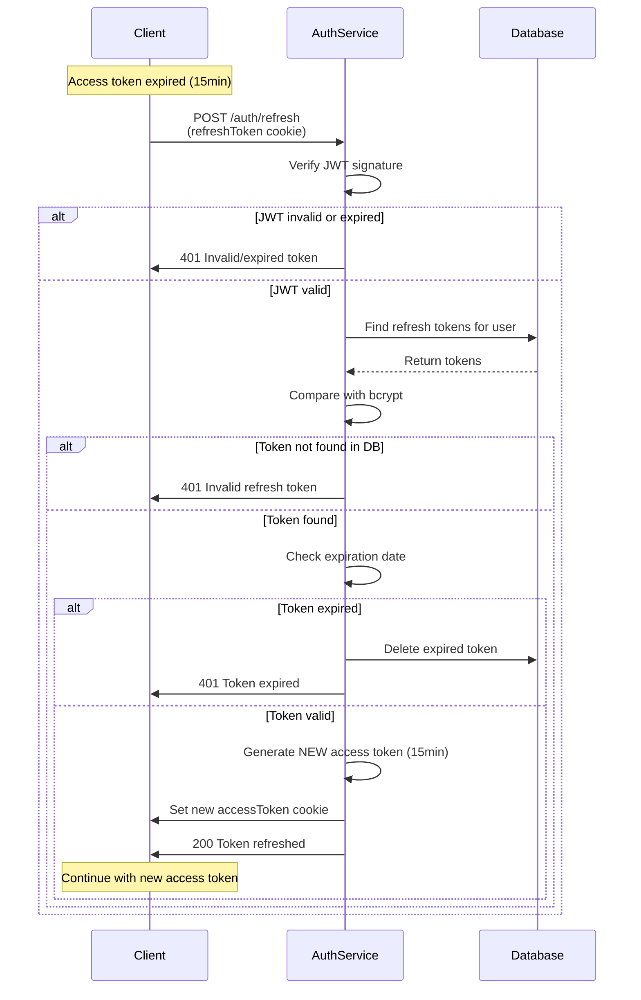
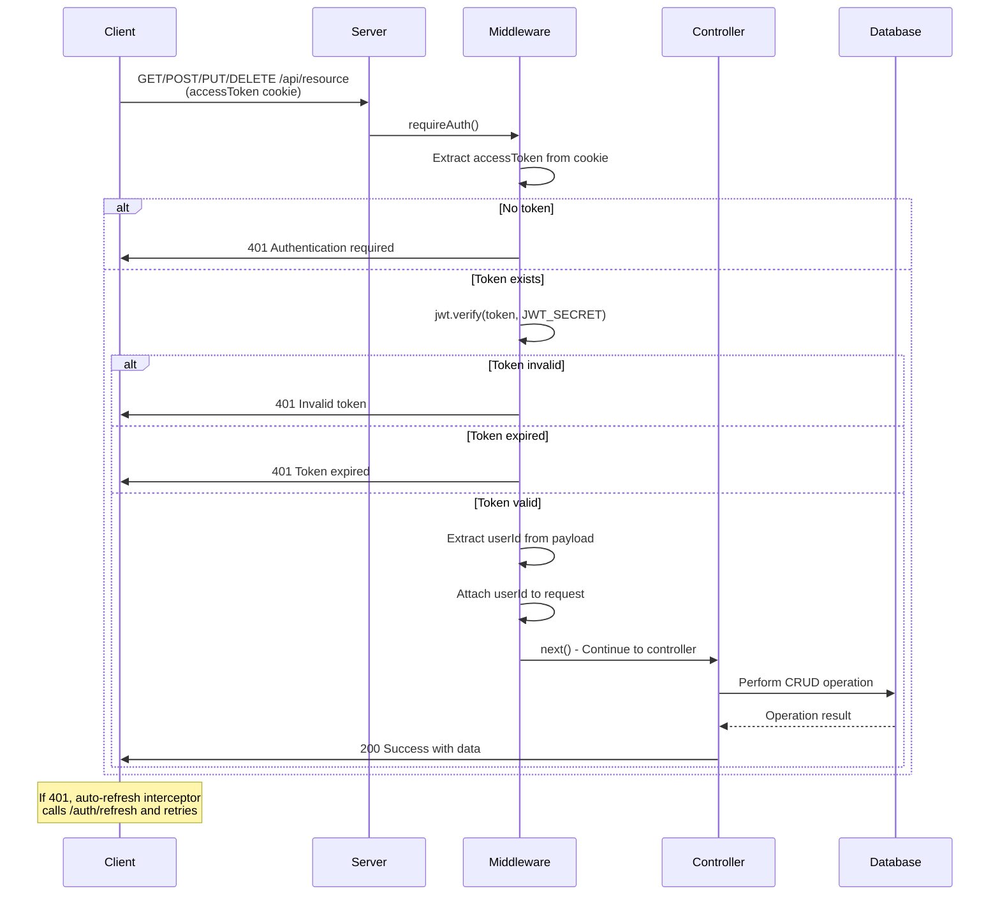

# Real Estate Project - Microservices Architecture

## Connect with Me

[](https://www.linkedin.com/in/bashar-alwarad-2a960b1b6/)

## �️ Architecture Overview

This project demonstrates **microservices architecture** with separate authentication service and main application server.

### **Services**

1. **Auth Service** (Port 4000) - Handles all authentication operations
2. **Main Server** (Port 3000) - Handles business logic (users, listings)
3. **Client** (Port 5173) - React frontend application

---

## 🎯 What You'll Learn

- **Microservices architecture** - Separating concerns into dedicated services
- **JWT authentication with refresh tokens** - Professional auth pattern
- **Local JWT verification** - High-performance token validation
- **Shared JWT secrets** - Stateless authentication across services
- **httpOnly cookies** - Secure token storage

---

## 🏗️ Architecture Decision: Local Verification

This project uses **local JWT verification** for authentication across microservices.

### Why Local Verification?

- ⚡ **Performance**: ~0.1-0.5ms verification time (vs 10-50ms with centralized)
- 🎯 **Simplicity**: No extra network calls or service dependencies
- 🔧 **Reliability**: No single point of failure
- 💰 **Cost-effective**: Minimal infrastructure overhead

### Trade-offs Accepted

- JWT_SECRET must be shared across services (using environment variables)
- Token revocation requires waiting for expiration (15 minutes for access tokens)
- Auth logic is duplicated across services (but standardized)

---

## 🔑 The Two-Token System

### **Access Token** (Short-lived: 15 minutes)

- Used for **every API request**
- Contains user information (userId)
- **Expires quickly** for security
- Stored as **httpOnly cookie**

### **Refresh Token** (Long-lived: 7 days)

- Used to **get new access tokens**
- **Hashed in database** for security
- Allows users to **stay logged in**
- Also stored as **httpOnly cookie**

---

## 🚀 Quick Start

### **Option 1: Run All Services at Once** (Recommended)

```bash
# First time setup - install all dependencies
npm run installall

# Start all services (auth-service, server, client)
npm run dev
```

### **Option 2: Run Services Individually**

```bash
# Terminal 1: Start Auth Service
cd auth-service
npm install
npm run dev

# Terminal 2: Start Main Server
cd server
npm run dev

# Terminal 3: Start Client
cd client
npm run dev
```

**Access Points:**

- Auth Service: http://localhost:4000
- Main Server: http://localhost:3000
- Client: http://localhost:5173

> 💡 **Tip:** See [SCRIPTS_GUIDE.md](./SCRIPTS_GUIDE.md) for all available commands and detailed usage

---

## ⚙️ Environment Variables

### Required in Both Services

**auth-service/.env**:

```env
PORT=4000
MONGODB_URI=mongodb://localhost:27017/auth_db
JWT_SECRET=your_super_secret_jwt_key_change_in_production
NODE_ENV=development
```

**server/.env**:

```env
PORT=3000
MONGODB_URI=mongodb://localhost:27017/real_estate_db
JWT_SECRET=your_super_secret_jwt_key_change_in_production  # MUST MATCH auth-service!
NODE_ENV=development
```

⚠️ **CRITICAL**: `JWT_SECRET` must be identical in both services for local verification to work!

---

## � Authentication Flow Diagrams

### 1. Signup Flow


```mermaid
sequenceDiagram
    participant Client
    participant AuthService
    participant Database

    Client->>AuthService: POST /auth/signup<br/>{userName, email, password}
    AuthService->>AuthService: Validate input
    AuthService->>Database: Check if user exists
    Database-->>AuthService: User not found ✓
    AuthService->>AuthService: Hash password (bcrypt, 12 rounds)
    AuthService->>Database: Create new user
    Database-->>AuthService: User created
    AuthService->>Client: Return user data (201)
    Note over Client: navigate to login
```

### 2. Login Flow


```mermaid
sequenceDiagram
    participant Client
    participant AuthService
    participant Database

    Client->>AuthService: POST /auth/login<br/>{email, password}
    AuthService->>Database: Find user by email
    Database-->>AuthService: User found
    AuthService->>AuthService: Compare password with bcrypt
    alt Password invalid
        AuthService->>Client: 401 Invalid credentials
    else Password valid
        AuthService->>AuthService: Generate access token (15min)
        AuthService->>AuthService: Generate refresh token (7 days)
        AuthService->>AuthService: Hash refresh token (bcrypt, 10 rounds)
        AuthService->>Database: Save hashed refresh token
        Database-->>AuthService: Token saved
        AuthService->>Client: Set httpOnly cookies<br/>(accessToken, refreshToken)
        AuthService->>Client: Return user data (200)
    end
    Note over Client: navigate to Home page

```

### 3. Refresh Token Flow


```mermaid
sequenceDiagram
    participant Client
    participant AuthService
    participant Database

    Note over Client: Access token expired (15min)
    Client->>AuthService: POST /auth/refresh<br/>(refreshToken cookie)
    AuthService->>AuthService: Verify JWT signature
    alt JWT invalid or expired
        AuthService->>Client: 401 Invalid/expired token
    else JWT valid
        AuthService->>Database: Find refresh tokens for user
        Database-->>AuthService: Return tokens
        AuthService->>AuthService: Compare with bcrypt
        alt Token not found in DB
            AuthService->>Client: 401 Invalid refresh token
        else Token found
            AuthService->>AuthService: Check expiration date
            alt Token expired
                AuthService->>Database: Delete expired token
                AuthService->>Client: 401 Token expired
            else Token valid
                AuthService->>AuthService: Generate NEW access token (15min)
                AuthService->>Client: Set new accessToken cookie
                AuthService->>Client: 200 Token refreshed
                Note over Client: Continue with new access token
            end
        end
    end
```

### 4. Protected CRUD Operations with Middleware


```mermaid
sequenceDiagram
    participant Client
    participant Server
    participant Middleware
    participant Controller
    participant Database

    Client->>Server: GET/POST/PUT/DELETE /api/resource<br/>(accessToken cookie)
    Server->>Middleware: requireAuth()
    Middleware->>Middleware: Extract accessToken from cookie
    alt No token
        Middleware->>Client: 401 Authentication required
    else Token exists
        Middleware->>Middleware: jwt.verify(token, JWT_SECRET)
        alt Token invalid
            Middleware->>Client: 401 Invalid token
        else Token expired
            Middleware->>Client: 401 Token expired
        else Token valid
            Middleware->>Middleware: Extract userId from payload
            Middleware->>Middleware: Attach userId to request
            Middleware->>Controller: next() - Continue to controller
            Controller->>Database: Perform CRUD operation
            Database-->>Controller: Operation result
            Controller->>Client: 200 Success with data
        end
    end

    Note over Client: If 401, auto-refresh interceptor<br/>calls /auth/refresh and retries
```

---

## �📖 How It Works

### **Step 1: User Logs In**

```typescript
// POST /auth/login
{
  "email": "user@example.com",
  "password": "password123"
}
```

**What happens:**

1. Server verifies password
2. Creates **access token** (15 min)
3. Creates **refresh token** (7 days)
4. Hashes refresh token with bcrypt
5. Saves hashed token to database
6. Sends **both tokens as cookies**

### **Step 2: User Makes Requests**

```typescript
// GET /users/me
// Cookies sent automatically by browser
```

**What happens:**

1. Middleware reads **accessToken** from cookie
2. Verifies JWT is valid
3. Extracts userId from token
4. Request continues ✅

### **Step 3: Access Token Expires**

After 15 minutes, access token expires.

**What happens:**

1. User makes request
2. Server returns **401 Unauthorized**
3. Client **automatically** calls `/auth/refresh`
4. Server verifies refresh token
5. Issues **new access token**
6. Client **retries original request**
7. User never notices! ✨

### **Step 4: User Logs Out**

```typescript
// POST /auth/logout
```

**What happens:**

1. Server finds refresh token in database
2. Deletes it from database
3. Clears both cookies
4. User is logged out ✅

---

## 📁 Key Files Explained

### **Backend**

| File                                        | Purpose                                |
| ------------------------------------------- | -------------------------------------- |
| `server/src/controllers/AuthControllers.ts` | Login, refresh, logout logic           |
| `server/src/middlewares/auth.ts`            | Protects routes, verifies access token |
| `server/src/models/RefreshToken.ts`         | Database model for refresh tokens      |
| `server/src/routes/AuthRoutes.ts`           | Auth endpoints                         |

### **Frontend**

| File                            | Purpose                                |
| ------------------------------- | -------------------------------------- |
| `client/src/utils/api.ts`       | **Auto-refresh interceptor**           |
| `client/src/pages/Login.tsx`    | Login form                             |
| `client/src/components/Nav.tsx` | Shows login/logout based on auth state |

---

## 🔍 Code Walkthrough

### **1. Login Flow** (`AuthControllers.ts`)

```typescript
export const login = async (req: Request, res: Response) => {
  // 1. Verify password
  const isPasswordValid = await bcrypt.compare(password, user.password);

  // 2. Create tokens
  const accessToken = jwt.sign({ userId }, secret, { expiresIn: '15m' });
  const refreshToken = jwt.sign({ userId }, secret, { expiresIn: '7d' });

  // 3. Hash and save refresh token
  const hashedRefreshToken = await bcrypt.hash(refreshToken, 10);
  await RefreshToken.create({ userId, token: hashedRefreshToken, expiresAt });

  // 4. Send as cookies
  res.cookie('accessToken', accessToken, { httpOnly: true, maxAge: 15min });
  res.cookie('refreshToken', refreshToken, { httpOnly: true, maxAge: 7days });

  // 5. Return user info
  res.json({ user });
};
```

### **2. Auth Middleware** (`auth.ts`)

```typescript
export const requireAuth = (req, res, next) => {
  // 1. Read access token from cookie
  const token = req.cookies?.accessToken;

  // 2. Verify it's valid
  const payload = jwt.verify(token, secret);

  // 3. Attach userId to request
  req.userId = payload.userId;

  // 4. Continue
  next();
};
```

### **3. Refresh Endpoint** (`AuthControllers.ts`)

```typescript
export const refresh = async (req: Request, res: Response) => {
  // 1. Get refresh token from cookie
  const refreshToken = req.cookies?.refreshToken;

  // 2. Verify JWT
  const payload = jwt.verify(refreshToken, secret);

  // 3. Find in database (compare with bcrypt)
  const tokenDocs = await RefreshToken.find({ userId: payload.userId });
  let validToken = null;
  for (const doc of tokenDocs) {
    if (await bcrypt.compare(refreshToken, doc.token)) {
      validToken = doc;
      break;
    }
  }

  // 4. Check if expired
  if (validToken.expiresAt < new Date()) {
    return res.status(401).json({ message: 'Expired' });
  }

  // 5. Create NEW access token
  const newAccessToken = jwt.sign({ userId }, secret, { expiresIn: '15m' });

  // 6. Send as cookie
  res.cookie('accessToken', newAccessToken, { httpOnly: true, maxAge: 15min });

  res.json({ message: 'Token refreshed' });
};
```

### **4. Auto-Refresh Interceptor** (`api.ts`)

```typescript
api.interceptors.response.use(
  (response) => response,
  async (error) => {
    // If 401 error and haven't retried yet
    if (error.response?.status === 401 && !originalRequest._retry) {
      originalRequest._retry = true;

      try {
        // Try to refresh token
        await api.post('/auth/refresh');

        // Retry original request with new access token
        return api.request(originalRequest);
      } catch {
        // Refresh failed - redirect to login
        window.location.href = '/login';
      }
    }

    return Promise.reject(error);
  }
);
```

---

## 🔒 Security Features

### ✅ Currently Implemented

1. **httpOnly cookies** - JavaScript cannot access tokens, prevents XSS attacks
2. **Short-lived access tokens** - 15 minutes limits exposure window
3. **Long-lived refresh tokens** - 7 days, stored hashed in DB with bcrypt
4. **Password hashing** - bcrypt with 12 rounds for user passwords
5. **Refresh token hashing** - bcrypt with 10 rounds before DB storage
6. **Token expiration** - Automatic JWT expiration checking
7. **Secure cookies in production** - `secure: true` when NODE_ENV=production
8. **Database storage** - Can revoke refresh tokens anytime, logout actually works

### 🔒 Additional Recommendations for Production

1. **Change JWT_SECRET**: Generate a strong random secret

   ```bash
   node -e "console.log(require('crypto').randomBytes(64).toString('hex'))"
   ```

2. **Use environment-specific secrets**: Different secrets for dev/staging/prod

3. **Enable CORS properly**: Whitelist only trusted origins

   ```typescript
   app.use(
     cors({
       origin: process.env.CLIENT_URL,
       credentials: true,
     })
   );
   ```

4. **Add rate limiting**: Prevent brute force attacks

   ```typescript
   import rateLimit from 'express-rate-limit';

   const loginLimiter = rateLimit({
     windowMs: 15 * 60 * 1000, // 15 minutes
     max: 5, // 5 attempts
   });

   app.post('/auth/login', loginLimiter, login);
   ```

5. **Monitor token usage**: Log suspicious activity
6. **Implement token blacklist** (optional): For critical cases where immediate revocation is needed

---

## 🎯 Testing the Flow

### **1. Test Login**

```bash
# Login
curl -X POST http://localhost:3000/auth/login \
  -H "Content-Type: application/json" \
  -d '{"email":"test@test.com","password":"password"}' \
  -c cookies.txt

# Check cookies
cat cookies.txt
# You'll see: accessToken and refreshToken
```

### **2. Test Protected Route**

```bash
# Use access token
curl http://localhost:3000/users/me -b cookies.txt

# Response: User data ✅
```

### **3. Test Auto-Refresh**

```bash
# Wait 15 minutes (or change maxAge to 10 seconds for testing)
# Make request again
curl http://localhost:3000/users/me -b cookies.txt

# First attempt: 401
# Auto-refresh happens
# Retry: 200 ✅
```

### **4. Test Logout**

```bash
curl -X POST http://localhost:3000/auth/logout -b cookies.txt

# Cookies cleared
# Token deleted from database
```

---

## 🔧 Troubleshooting

### "Invalid token" errors

1. **Check JWT_SECRET matches**: Both auth-service and server must use the same secret
2. **Check token expiration**: Access tokens expire after 15 minutes
3. **Try refreshing token**: Use `/auth/refresh` endpoint
4. **Clear cookies and re-login**: Start fresh

### "Authentication required" errors

1. **Check cookies are being sent**: Browser must include credentials
2. **Check CORS settings**: Must allow credentials (`credentials: true`)
3. **Check cookie domain**: Must match server domain

### Token not refreshing

1. **Check refresh token cookie exists**: Should be named `refreshToken`
2. **Check refresh token not expired**: Valid for 7 days
3. **Check database has token**: Look in RefreshToken collection
4. **Check auto-refresh interceptor**: Verify `api.ts` interceptor is configured

---

## 💡 Learning Exercises

### **Beginner**

1. Add console.logs to trace the entire login flow
2. Change token expiry times and observe behavior
3. Add a "remember me" checkbox (longer refresh token)

### **Intermediate**

4. Add refresh token rotation (new refresh token on each refresh)
5. Implement "logout all devices" (delete all user tokens)
6. Add token metadata (IP, device, last used)

### **Advanced**

7. Implement token reuse detection
8. Add multi-tab coordination with BroadcastChannel
9. Create an admin panel to view active sessions

---

## 📚 Additional Resources

- [JWT.io](https://jwt.io/) - Decode and verify JWTs
- [OWASP Auth Cheatsheet](https://cheatsheetseries.owasp.org/cheatsheets/Authentication_Cheat_Sheet.html) - Security best practices
- [bcrypt](https://github.com/kelektiv/node.bcrypt.js) - Password hashing library

---

## 🔮 Future Considerations

### When to Switch to Centralized Verification

Consider switching from local to centralized token verification if you need:

1. **Immediate token revocation** - Cannot wait 15 minutes for expiration
2. **Multiple services (5+)** - Many services need authentication
3. **Centralized audit logs** - Track all auth events in one place
4. **Advanced security features** - IP filtering, device tracking, geolocation checks
5. **Different teams** - Each team manages their own service independently

### Migration Path

If you decide to switch later:

1. Create a centralized `/verify-token` endpoint in auth-service
2. Update `requireAuth` middleware to call auth-service instead of local verification
3. Implement caching layer (Redis) to minimize network calls
4. Add circuit breaker pattern for fault tolerance
5. Keep fallback to local verification if auth-service is down

---

## 🎓 Next Steps

1. ✅ Read through `AuthControllers.ts` - understand each step
2. ✅ Test login/logout flow in the browser
3. ✅ Examine the auto-refresh interceptor in `api.ts`
4. ✅ Try the exercises above to deepen understanding
5. ✅ Review environment variables and ensure JWT_SECRET matches

---

## 📂 Key Files Reference

### Backend Core

- `auth-service/src/controllers/AuthControllers.ts` - Authentication logic
- `auth-service/src/middlewares/auth.ts` - Auth middleware for auth-service
- `auth-service/src/routes/AuthRoutes.ts` - Auth endpoints
- `server/src/middlewares/auth.ts` - Auth middleware for main server
- `server/src/controllers/AuthControllers.ts` - Server auth logic
- `server/src/models/RefreshToken.ts` - Refresh token database model

### Frontend Core

- `client/src/utils/api.ts` - Axios instance with auto-refresh interceptor
- `client/src/utils/authApi.ts` - Auth-specific API calls
- `client/src/pages/Login.tsx` - Login form
- `client/src/pages/Signup.tsx` - Signup form
- `client/src/components/Nav.tsx` - Navigation with auth state

---

**Last Updated**: October 22, 2025  
**Architecture**: Microservices with Local JWT Verification
